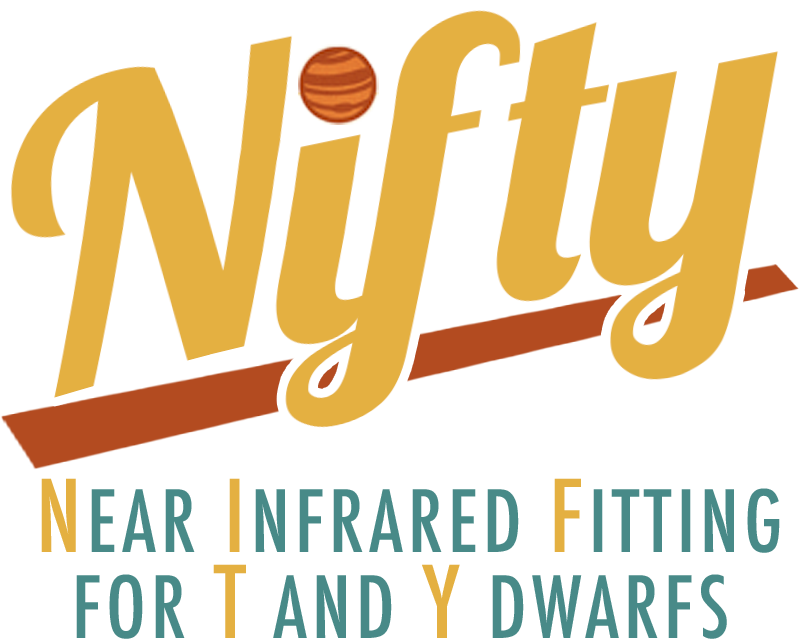

# NIFTY
*Near-Infrared Fitting for T and Y Dwarfs*

*Kevin Hainline and Jake Helton*

NIFTY is a code designed to fit JWST NIRCam/MIRI photometry or NIRSpec prism
spectroscopy of cold brown dwarf candidates with the LOWZ (Meisner et al. 2021),
ATMO2020 (Phillips et al. 2020), Sonora Elf Owl v2 (Mukherjee et al. 2024,
Wogan et al. 2025), or earlier Sonora Elf Owl (with PH3, Beiler et al. 2024) atmospheric models, using 
a Bayesian framework with the emcee sampler (https://emcee.readthedocs.io/en/stable/user/sampler/). 
This code was described in Hainline et al. (2026) (doi.org/10.48550/arXiv.2510.00111).

NIFTY operates in two modes:

- **`phot`** — fit broadband photometry from a catalog of one or more sources.
- **`spec`** — fit a single NIRSpec prism spectrum.

In both modes, NIFTY produces a corner plot, a best-fit SED or spectrum plot,
and a text file with the 16th, 50th, and 84th percentiles of all fit parameters.
Photometry fits typically converge in under 10 minutes per source for ~14 bands,
though convergence time varies, especially at high SNR. Spectroscopic fits are slightly
longer.

## Installation

Installation can be done through conda or micromamba:

```
(base) % conda env create -f environment.yml
(base) % conda activate NIFTY
(NIFTY) % python -m pip install astro-sedpy corner xarray
```

## Creating the Interpolation Files

Before running NIFTY, download the model grids you want to fit against, then
run `create_NIFTY_interpolator.py` to build the pickle file that NIFTY uses
during fitting. You only need to do this once per model.

```
python create_NIFTY_interpolator.py \
    -model  <model>                 \
    -path   /path/to/model/files/   \
    -config BD_NIRCam_MIRI_filters.json
```

The `-model` argument accepts: `SonoraElfOwl`, `SonoraElfOwlPH3`, `ATMO2020`, `LOWZ`.

**Examples:**

```
(NIFTY) % python create_NIFTY_interpolator.py \
    -model LOWZ \
    -path /path/to/LOWZ/ \
    -config BD_NIRCam_MIRI_filters.json

(NIFTY) % python create_NIFTY_interpolator.py \
    -model SonoraElfOwl \
    -path /path/to/Sonora_Elf_Owl_v2/ \
    -config BD_NIRCam_MIRI_filters.json

(NIFTY) % python create_NIFTY_interpolator.py \
    -model SonoraElfOwlPH3 \
    -path /path/to/Sonora_PH3/ \
    -config BD_NIRCam_MIRI_filters.json

(NIFTY) % python create_NIFTY_interpolator.py \
    -model ATMO2020 \
    -path /path/to/meisner_2023/ \
    -config BD_NIRCam_MIRI_filters.json
```

By default, the output pickle files are named:

| Model | Output file |
|---|---|
| `SonoraElfOwl` | `Sonora_v2_interp.pkl` |
| `SonoraElfOwlPH3` | `Sonora_PH3_interp.pkl` |
| `ATMO2020` | `ATMO2020_interp.pkl` |
| `LOWZ` | `LOWZ_interp.pkl` |

These files should stay in the same directory as `NIFTY.py`. You can override
the output filename with the optional `-output` argument.

The Sonora Elf Owl model grid spans several tens of GB and can take a few hours
to process. The other grids are considerably smaller.

### Expected model directory layouts

**SonoraElfOwl** — temperature-range subdirectories containing NetCDF files:
```
Sonora_Elf_Owl_v2/
    output_275.0_325.0/
        spectra_logzz_2.0_teff_275.0_grav_17.0_mh_-0.5_co_0.5.nc
        ...
    output_350.0_400.0/
    ...
```

**SonoraElfOwlPH3** — a single `.npz` file:
```
Sonora_PH3/
    elf_owl_disequilibrium_PH3.npz
```

**ATMO2020** — per-metallicity subdirectories containing `.dat` files:
```
meisner_2023/
    grid_m1.0/
        spec_jwst_t700_g3.5_m1.0_kg_g3.5.dat
        ...
    grid_m0.5/
    grid_p0/
    grid_p0.3/
```

**LOWZ** — flat `models/` directory plus a CSV index:
```
LOWZ/
    LOWZ_models_index.csv
    models/
        LOW_Z_<...>.txt
        ...
```

## Running NIFTY

NIFTY requires a `-mode` argument (`phot` or `spec`) and a `-model` argument.
The available models are `SonoraElfOwl`, `SonoraElfOwlPH3`, `ATMO2020`, and `LOWZ`.

### Photometry mode (`-mode phot`)

Fit broadband photometry for one or more sources from a catalog.

**Single source:**
```
(NIFTY) % python -W ignore NIFTY.py \
    -mode phot \
    -model LOWZ \
    -config_file BD_NIRCam_MIRI_filters.json \
    -photometry /path/to/photometry_file.fits \
    -survey_stub JADES-GS \
    -id 20541
```

**List of sources from a file** (first column = IDs):
```
(NIFTY) % python -W ignore NIFTY.py \
    -mode phot \
    -model SonoraElfOwl \
    -config_file BD_NIRCam_MIRI_filters.json \
    -photometry /path/to/photometry_file.fits \
    -survey_stub JADES-GS \
    -idlist all_source_IDs.dat
```

**Inline list of IDs:**
```
(NIFTY) % python -W ignore NIFTY.py \
    -mode phot \
    -model ATMO2020 \
    -config_file BD_NIRCam_MIRI_filters.json \
    -photometry /path/to/photometry_file.fits \
    -survey_stub JADES-GS \
    -idarglist '20541, 452029, 430165'
```

### Spectroscopy mode (`-mode spec`)

Fit a single NIRSpec prism spectrum. The spectrum file should be a
whitespace-delimited text file with three columns: wavelength (microns),
flux (nJy), and flux error (nJy). The `-id` argument is used only to
label output files.

```
(NIFTY) % python -W ignore NIFTY.py \
    -mode spec \
    -model SonoraElfOwl \
    -spectroscopy /path/to/spectrum.txt \
    -survey_stub JADES-GS \
    -id 20541
```

### Optional arguments

| Argument | Description |
|---|---|
| `-output <dir>` | Output folder (default: `<Model>_output/`) |
| `-frac_model_floor <f>` | Fractional model flux floor added in quadrature to photometry errors, to account for model systematics (e.g. `0.03` for 3%). Photometry mode only; no floor is applied in spectroscopy mode. |

## Configuration File (`-config_file`)

NIFTY uses a single JSON file to describe all filter information needed for
photometry fitting. Here is a sample entry:

```json
{
  "filter_columns": {
    "F115W": {
      "extension": "CIRC",
      "flux": "F115W_CIRC3",
      "error": "F115W_CIRC3_e",
      "wavelength": 1.154
    },
    "F444W": {
      "extension": "CIRC",
      "flux": "F444W_CIRC3",
      "error": "F444W_CIRC3_e",
      "wavelength": 4.408
    }
  }
}
```

- `extension`: the FITS HDU name where this filter's data lives. Ignored for
  plain-text catalogs.
- `flux` / `error`: exact column names in the photometry file.
- `wavelength`: filter central wavelength in microns, used for plotting.

An example config file for JADES NIRCam + MIRI observations is included as
`BD_NIRCam_MIRI_filters.json`.

## Photometry File Format (`-photometry`)

NIFTY can read:

- **FITS** files, with filter fluxes and errors in named HDU extensions and
  columns as specified in the config JSON.
- **Plain-text** catalogs, whitespace-delimited, one row per object.

For plain-text catalogs, include an `ID` column (case-sensitive) and flux/error
columns whose names match the config JSON exactly. Do not prefix the header line
with `#`. Example:

```
ID     F115W_CIRC3     F115W_CIRC3_e     F444W_CIRC3     F444W_CIRC3_e
101    0.123           0.010             0.456           0.025
```

All fluxes and errors should be in nJy. A minimum relative flux error of 5% is
applied automatically; errors below this floor are inflated to `0.05 * flux`.

## Output Files

For each fitted source, NIFTY writes the following files to the output directory:

| File | Description |
|---|---|
| `<stub>_<ID>.h5` | Full emcee chain (HDF5) |
| `<stub>_<ID>_Corner_<Model>.png` | Corner plot of the posterior |
| `<stub>_<ID>_SED_<Model>.png` | Best-fit SED or spectrum plot |
| `<stub>_<ID>_SED_<Model>.txt` | Model spectrum envelope (16th, 50th, 84th percentile flux, in nJy, vs wavelength in microns) |
| `<stub>_<ID>_parameters_<Model>.txt` | 16th, 50th, and 84th percentile parameter values, plus chi-square. Distance is in parsecs. |
| `<stub>_<ID>_photometry_<Model>.txt` | Model photometry at filter wavelengths (**phot mode only**) |

## Model Parameters

| Model | Parameters fit |
|---|---|
| `SonoraElfOwl` | Teff, log(g), log(Kzz), [M/H], C/O, distance (pc) |
| `SonoraElfOwlPH3` | Teff, log(g), log(Kzz), [M/H], C/O, distance (pc) |
| `ATMO2020` | Teff, log(g), [M/H], distance (pc) |
| `LOWZ` | Teff, log(g), log(Kzz), [M/H], C/O, distance (pc) |

All fits assume a source radius of 1 Jupiter radius. Distances are always
reported in parsecs.

## References

- Meisner et al. 2021 (LOWZ): https://doi.org/10.3847/1538-4357/ac013c
- Phillips et al. 2020 (ATMO2020): https://doi.org/10.1051/0004-6361/201937381 
- Mukherjee et al. 2024 (Sonora Elf Owl): https://doi.org/10.3847/1538-4357/ad18c2
- Wogan et al. 2025 (Sonora Elf Owl v2): https://doi.org/10.3847/2515-5172/add407
- Beiler et al. 2024: https://doi.org/10.5281/zenodo.11370829
- Foreman-Mackey et al. 2013 (emcee): https://doi.org/10.1086/670067
